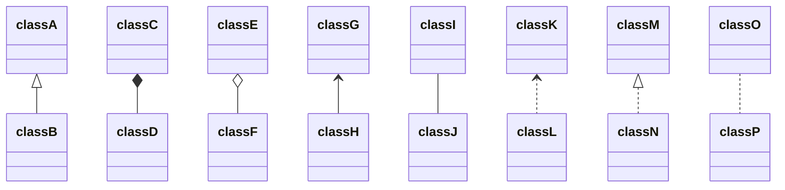
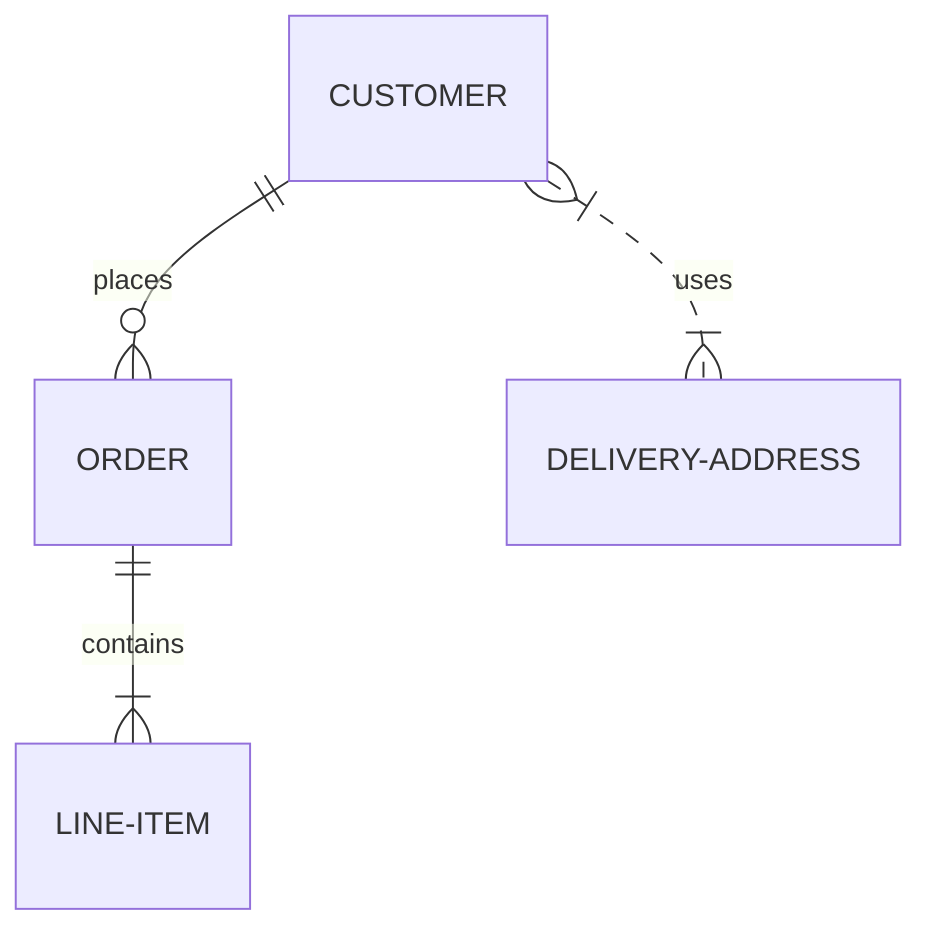

```mermaid
graph TB
    需求未满足；安全感受威胁；自尊、感情受伤害 --> 愤怒
    subgraph
    不表达：积郁、低效率  
    发泄：破坏性  
    控制：传递邀请
    end
    subgraph
    愤怒-->`真实意图`：
    不愿引起争执  
    希望被理解  
    被爱惜  
    被支持
    end

# Mermaid Test

    ```mermaid
    graph TB
        c1-->a2
        subgraph one
        a1-->a2
        end
        subgraph two
        b1-->b2
        end
        subgraph three
        c1-->c2
        end
    ```

```mermaid
graph TB
    c1-->a2
    subgraph one
    a1-->a2
    end
    subgraph two
    b1-->b2
    end
    subgraph three
    c1-->c2
    end
```





